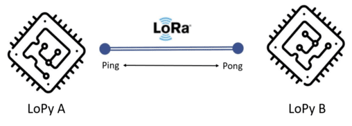
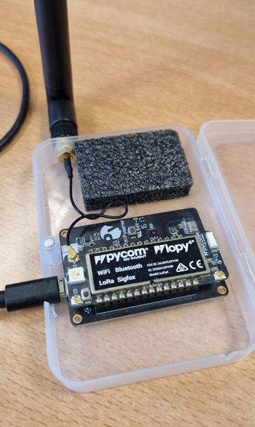
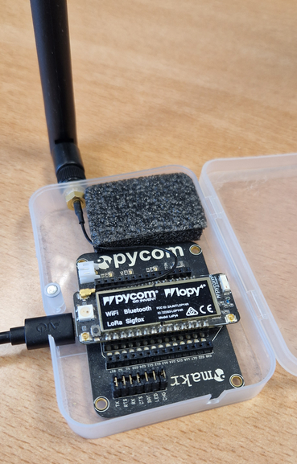

# LoRaCTP: LoRa Content Transfer Protocol


The code in this repository allows to transfer blocks of bytes ("content") over a LoRa (pure LoRa, no LoRaWAN) channel. The library was tested with content of the size of up to 500kB.

Based on https://github.com/pmanzoni/loractp

Details of the protocol can be found in this paper:
> K. Nakamura, P. Manzoni, M. Zennaro, J. -C. Cano and C. T. Calafate, 
> "[Invited] LoRaCTP: a LoRa based Content Transfer Protocol for sustainable edge computing," 
> 2020 16th International Conference on Mobility, Sensing and Networking (MSN), 2020, pp. 539-545, 
> [doi: 10.1109/MSN50589.2020.00090.](https://doi.org/10.1109/MSN50589.2020.00090)


## Technical details

* [LoPy4](https://pycom.io/product/lopy4/) quadruple bearer MicroPython enabled development board. 

* [Pysense board](https://pycom.io/product/pysense-2-0-x/)

* [Expansion board](https://docs.pycom.io/datasheets/expansionboards/expansion3/)

* Firmware version: Pycom MicroPython 1.20.0.rc13 [v1.9.4-94bb382] on 2019-08-22.


## Getting started

These instructions will get you a copy of the project up and running on your local machine for development and testing purposes in your lopy.


### Prerequisites

This is the basic information required to set up a suitable development environment for a Pycom device, in this case the LoPy's.

You first need to have Python 3 and Pip 3 installed in your computer. Check here for the proper instructions and code:
```
https://www.python.org/download/releases/3.0/

$ sudo apt install python3
$ sudo apt install python3-pip
```

Install the software required to connect to the LoPy device
```
$ sudo python3 -m pip install mpy-repl-tool
```

For more information you can check the full [documentation](https://docs.pycom.io/)


### Installing

Now you can download and install the project in your devices.

First download the .ZIP, extract it in your machine.

To install the repository in the LoPy device, open a terminal on the project's location.

Verify if the device has been recognized:
```
$ sudo python3 -m there detect
```

Confirm that the device only contains the main.py and boot.py files:
```
$ sudo python3 -m there ls -l /flash/ *
```

Upload the files of the repository to the device:
```
$ sudo python3 -m there push *.py /flash
```

### Files

The code in this folder is written in MicroPython and tested on:

Files contained:

* File `boot.py` simply disables the WiFi to limit interferences.

* File `loractp.py` includes the class definition. 

* File `ping.py` and `pong.py` are an example of a request/response interaction. Basically, `ping.py` sends a message and `pong.py` waits for a message and once received it replies it. `pingrnd.py` sends a random number, `pingmsg.py` sends a text input by user.

* File `plainreceiver.py` shows an example of a basic receiving node.

Example of a request/response interaction (ping/pong).




## Experimental

Both devices (LoPyA and LoPyB), must have at least LoRaCTP and request/response files.

As a first step, you must run pong.py on the LoPyB. When the device is in listening mode you can run ping.py on LoPyA.

If you want to transmit a tex message between the two LoPy's, you must run pingmsg.py on LoPyA.

### The ping/pong example

For the experiment the LoPyA is mounted on a Pysense board.




And the LoPyB on an Expansion board.




## Authors

* **Kiyoshy Nakamura**
* **Pietro Manzoni**

## License

This project is licensed under the GNU GPLv3 - see the [LICENSE](LICENSE) file for details.